# Testing

[Unit testing coverage](jacoco/index.html)

## Performance testing

### MyBigInteger vs. BigInteger

Performance testing for MyBigInteger was done running the operations 100 000 times, taking the average time ran for single operation.
For more expensive operations, the testing was done way less times.
In testing, same parametres were used for both MyBigInteger and BigInteger.

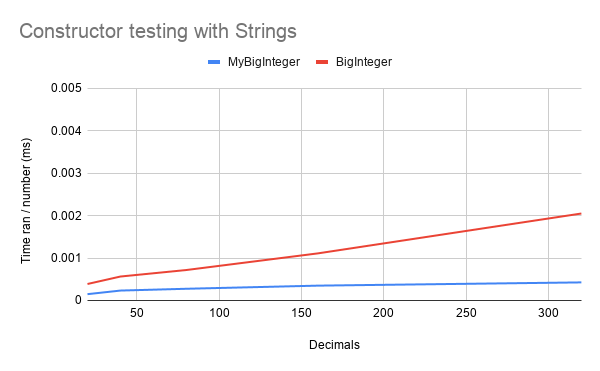

Was done by generating random numbers of certain length.

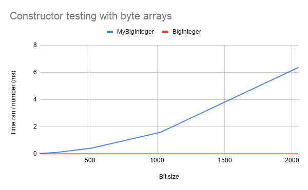

Was done by generating random byte arrays of certain length.

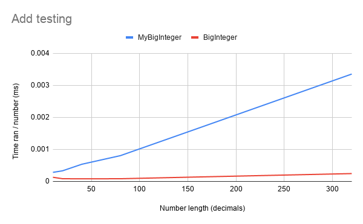

Was done by adding the next number to the current number.

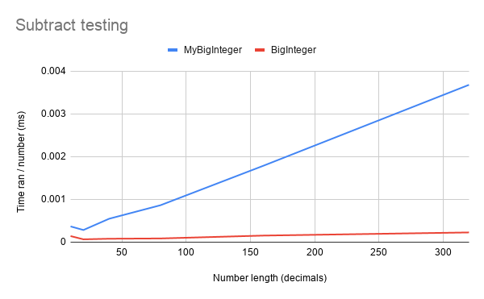

Was done by subtracting the next number from the current number.

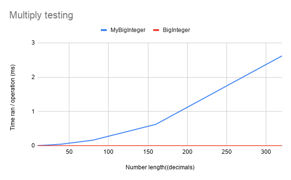

Was done by multiplying the current number with the next number.

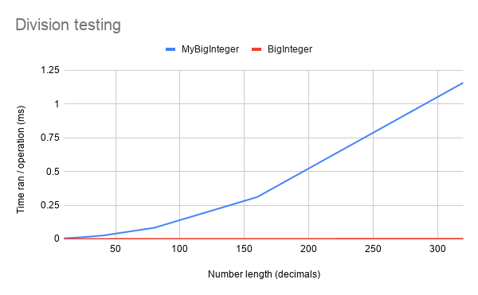

Was done by dividing the current number with a random number half the length.

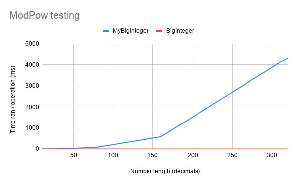

Was done by taking power of the next number and mod of a random number half the length.

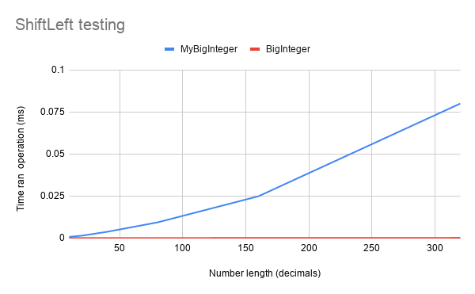

Was done by doing Left shift operation.

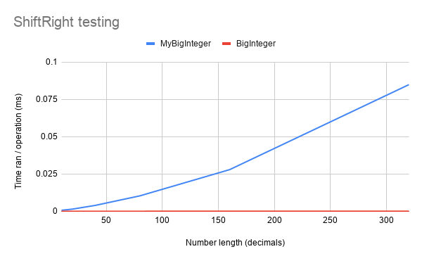

Was done by doing Right shift operation.

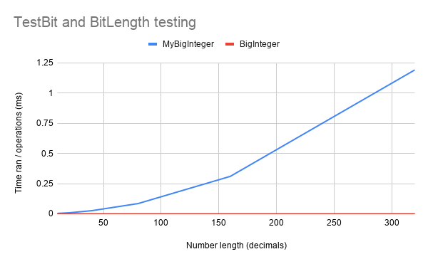

Was done by testing the middle bit. Middle bit was got by taking BitLength divided by two.

### MyRandom vs. SecureRandom

Performance test for MyRandom was done running the operation 100 000 times and calculating the average time.

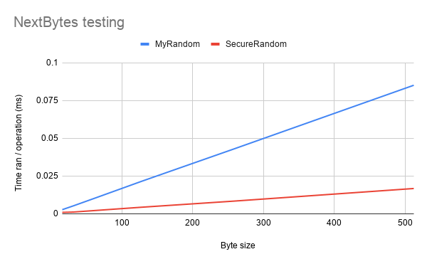

Was done by doing NextBytes operation.

### KeyGenerator testing

Performance tests for KeyGenerator were done using the KeyGenerator with MyBigInteger, BigInteger and then using a 3rd party library.

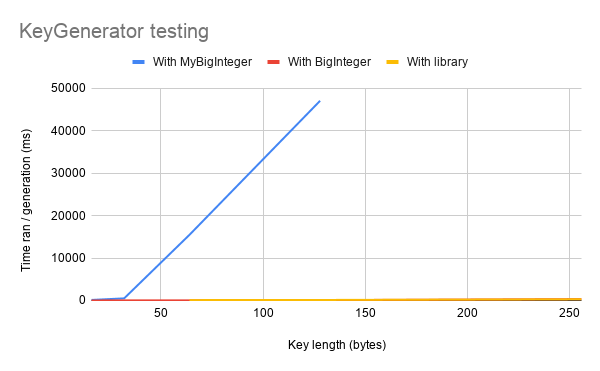

Was done by running the key generation operation. The operation was only ran once due to the slowness of the operation of MyBigInteger.

### Key testing

Performance tests were ran 1000 times and then calculated the average time.

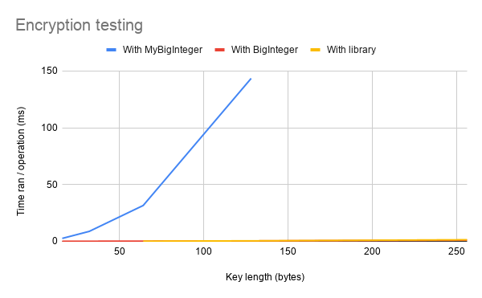

Was done by running the encryption for String "Kissa on kiva".

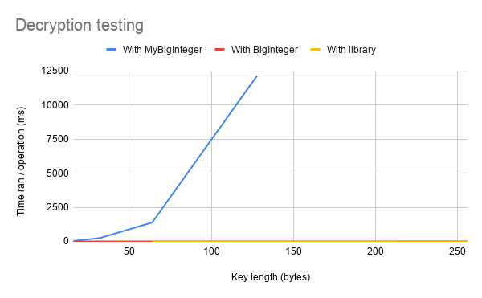

Was done by running the decryption for the encrypted String of "Kissa on kiva".
For MyBigInteger, the decryption was only ran 50 times for 64 bytes and 10 times for 128 bytes.

## The results

For MyBigInteger, Add and Subtract seem to be working O(n) time.
Multiply and Division are exponentially increasing, so they work in O(n^k) time.
Because ModPow uses both operations, it works also in O(n^k) time.
ShiftLeft and ShiftRight operations are working in O(n) time.
TestBit and BitLength operations should be working O(n) time.

KeyGenerator with MyBigInteger works exponentially increasing, because it uses MyBigInteger. With BigInteger, it's working in O(n) time, having same times close to the ready library.

Encryption and Decryption with MyBigInteger work exponentially increasing, because of MyBigInteger. With BigInteger, the operations work same time as the ready library.

